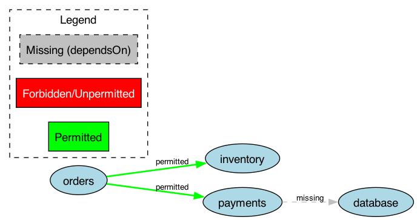

# ArchGuard-M3: Architectural Drift Detector for Microservices

**ArchGuard-M3** is a static analysis tool built with the **Rascal Meta Programming Language**. It detects architectural drift in microservices by comparing a planned architecture — defined in a custom DSL — against the actual implementation extracted from Java source code using Rascal's **M3** model.

## Core Capabilities

* **Architecture DSL** — Define permitted, forbidden, and expected service dependencies using a simple rule language.
* **Spring-Aware M3 Extraction** — Recover dependency graphs from Java source code, including method invocations, type dependencies, `@FeignClient`, `RestTemplate`/`WebClient`, `@Repository`, and HTTP endpoint annotations.
* **Drift Validation** — Detect forbidden couplings, unpermitted dependencies, missing expected links, and circular dependencies using relational algebra (set intersection, set difference, transitive closure).
* **Technical Debt Scoring** — Quantify drift severity with weighted scores (Critical: 10, Warning: 5, Info: 1).
* **Graphviz Visualization** — Export color-coded dependency graphs as DOT/PNG files with a legend.
* **LaTeX Report Generation** — Generate publication-ready `.tex` reports with `longtable` violation details and summary statistics.

## System Architecture

The tool operates in three phases:

1. **Oracle (DSL)** — Parse `.arch` rule files into an AST defining the intended architecture.
2. **Analyzer (M3)** — Extract an M3 model from Java source code and derive a service dependency graph.
3. **Comparator** — Perform relational algebra to compute the delta between design and implementation.

## Repository Structure

```
src/
├── ArchGuard.rsc                        # Main pipeline orchestrator
├── lang/arch/
│   ├── Syntax.rsc                       # DSL grammar (concrete syntax)
│   ├── Parser.rsc                       # String → parse tree
│   ├── AST.rsc                          # Abstract syntax + conversion
│   ├── TestParser.rsc                   # Parser tests (14 cases)
│   └── TestAST.rsc                      # AST conversion tests (10 cases)
├── extract/
│   ├── M3Extractor.rsc                  # Spring-aware M3 extraction
│   ├── SpringBootAnalyzer.rsc           # Deep Spring Boot analysis
│   └── TestM3Extractor.rsc              # Extraction tests (16 cases)
├── check/
│   ├── DriftValidator.rsc               # Relational algebra validation
│   ├── Reporter.rsc                     # Text + LaTeX report formatting
│   ├── TestDriftValidator.rsc           # Validation tests (22 cases)
│   └── TestIntegration.rsc              # End-to-end pipeline tests (16 cases)
├── vis/
│   ├── DotExporter.rsc                  # Graphviz DOT graph generator
│   └── DriftVisualizer.rsc              # Rascal vis::Figure visualizer
examples/
├── sample.arch                          # Example DSL rules
├── drift_report.tex                     # Generated LaTeX report
├── drift_graph.dot                      # Generated DOT (full graph)
├── drift_graph.png                      # Rendered full graph
├── drift_violations.dot                 # Generated DOT (violations only)
├── drift_violations.png                 # Rendered violations graph
└── sample-ms/                           # Sample Java microservices
    └── com/example/{orders,payments,inventory}/
```

## DSL Syntax

Architecture rules are defined in `.arch` files using three keywords:

```
service "Orders" permits {"Payments", "Inventory"}
service "Orders" forbids {"Analytics"}
service "Payments" dependsOn {"Database"}
```

* **permits** — The service is allowed to depend only on the listed targets. Any other dependency is flagged as a warning.
* **forbids** — The service must not depend on the listed targets. Violations are flagged as critical.
* **dependsOn** — The service is expected to depend on the listed targets. Missing dependencies are flagged as info.

## Prerequisites

* **Java 11+** (required to run the Rascal shell)
* **Rascal shell JAR** (`rascal-shell-stable.jar`) — place it in the project root
* **Graphviz** (optional, for rendering DOT graphs to PNG) — `brew install graphviz`
* **LaTeX** (optional, for compiling `.tex` reports to PDF) — `brew install --cask mactex`

## Quick Start

### 1. Launch the Rascal REPL

```bash
java -jar rascal-shell-stable.jar
```

> Launch from the project root so that `src/` is in the Rascal search path.

### 2. Run the test suite

```rascal
import check::TestIntegration;
import lang::arch::TestParser;
import lang::arch::TestAST;
import extract::TestM3Extractor;
import check::TestDriftValidator;
:test
```

This runs all **78 tests** across 5 modules (parser, AST, extraction, validation, integration).

### 3. Analyze a Java project

```rascal
import ArchGuard;

printAnalysis(
  |file:///path/to/rules.arch|,
  |file:///path/to/java/project|,
  2
);
```

The `serviceDepth` parameter controls how service names are derived from Java package paths. For `com.example.orders.controller`, depth `2` yields `"orders"`.

### 4. Export a LaTeX report

```rascal
import ArchGuard;
import check::Reporter;

report = analyze(|file:///path/to/rules.arch|, |file:///path/to/project|, 2);
exportFullReport(report, |file:///path/to/output.tex|);
```

Then compile:

```bash
pdflatex output.tex
```

### 5. Export a Graphviz dependency graph

```rascal
import ArchGuard;
import vis::DotExporter;
import extract::M3Extractor;

arch = loadArchitecture(|file:///path/to/rules.arch|);
actual = extractArchitecture(|file:///path/to/project|, 2);
report = analyzeFromModels(arch, actual);

// Full graph: green (permitted) + red (violations) + grey dashed (missing)
exportDot(report, actual.invocations, |file:///path/to/graph.dot|);

// Violations only
exportDot(report, |file:///path/to/violations.dot|);
```

Then render:

```bash
dot -Tpng graph.dot -o graph.png
```

### 6. Interactive visualization (Eclipse IDE)

If using Rascal inside the Eclipse IDE (where `vis::Figure` is available):

```rascal
import vis::DriftVisualizer;
renderDriftGraph(report);
renderDriftGraph(report, actual.invocations);
```

## Sample Output

### Drift Graph



* **Green edges** — Permitted dependencies (no violations)
* **Red edges** — Forbidden or unpermitted dependencies
* **Grey dashed edges** — Missing expected `dependsOn` links

### Console Report

```
=== Extraction Summary ===
Services discovered: inventory, orders, payments
Cross-service invocations: 2
Cross-service type deps: 6
HTTP endpoints: 2
DB entities: 2
Feign clients: 0
REST clients: 0
Repositories: 1

=== ArchGuard-M3 Drift Report ===

[INFO    ] Missing expected dependency: Payments -/> Database

--- Summary ---
Findings: 1 (Critical: 0, Warning: 0, Info: 1)
Technical Debt Score: 1
```

### LaTeX Report

The generated `.tex` file produces a formatted PDF with:
* Summary section (findings breakdown + technical debt score)
* Violation details table (severity, source, target, rule violated)

## Module Reference

**Pipeline**
* **`ArchGuard`** — `runAnalysis`, `runFullAnalysis`, `analyze`, `analyzeFromModels`, `exportFullReport`, `printAnalysis`, `loadArchitecture`.

**DSL (lang::arch)**
* **`Syntax`** — Concrete syntax grammar for the architecture DSL.
* **`Parser`** — `parseArchitecture(str)` → parse tree.
* **`AST`** — `buildAST(parseTree)` → `Architecture` ADT.

**Extraction (extract)**
* **`M3Extractor`** — `extractArchitecture(loc, int)` → `ExtractionResult` with services, invocations, type deps, endpoints, DB entities, Feign clients, REST clients, and repositories.
* **`SpringBootAnalyzer`** — `analyzeSpringBoot(loc, int)` → `SpringAnalysis` with cross-DB access detection.

**Validation (check)**
* **`DriftValidator`** — `validate(arch, actual)` / `validateFull` / `validateGraph` → `ValidationReport`. Uses set intersection (`&`) for forbids, set difference (`-`) for dependsOn, filtered difference for permits, transitive closure (`+`) for cycles.
* **`Reporter`** — `formatReport`, `generateLatexTable`, `generateLatexSummary`, `generateFullLatex`.

**Visualization (vis)**
* **`DotExporter`** — `generateDot(report)` / `generateDot(report, graph)` / `exportDot`. Produces Graphviz DOT files with color-coded edges and legend.
* **`DriftVisualizer`** — `renderDriftGraph(report)` / `renderDriftGraph(report, graph)`. Interactive Swing-based visualization (requires Eclipse IDE or Swing-capable Rascal shell).

---
Developed using Rascal by carlix with love
